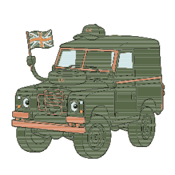

# mascot-forge

**Turn a static image into a rigged, articulated, telemetry-aware web mascot — as code you own.**



> _Interim still. The live before/after showcase animates two assets side by side — serve the repo
> and open [`docs/buildable-slice/showcase.html`](docs/buildable-slice/showcase.html). An animated
> GIF/screenshot of that page is the one remaining capture step (see [CONTRIBUTING](CONTRIBUTING.md))._

mascot-forge is an open-source pipeline that takes a flat raster image (PNG, pixel-art
first) and produces an **animated, component-segmented mascot** that you drop into a
React app. Unlike a black-box runtime, the output is **human-readable code you can read,
edit, and own**: a `.tsx` component, GSAP timelines (or pure SVG/CSS), and a small
state machine that binds animation states to your application's live data.

**Proven on two visually different assets** — a pixel-art creature (DevBrain) and a cartoon
vehicle (Land Rover) — forged by the same engine with **zero engine edits** (see the
[second-asset validation](spikes/03-second-asset/FINDINGS.md)). That is the difference between
*one hand-tuned demo* and *an engine*.

> Status: **v1 complete** (pre-1.0). The full pipeline runs end-to-end — vectorize → segment →
> emit → orchestrate — and is verifiable with one command (`tools/check-all.ps1`). Two assets are
> proven; the engine is asset-agnostic. Scoped to the SVG+CSS / React+GSAP Output Targets; broader
> automation is post-1.0. See the [Run / Quickstart](#run--quickstart) section and [`docs/`](docs/).

---

## Why this exists

Modern AI is great at generating *static* mascots and *heavy* video loops. The painful
gap is the step *after* art exists: turning a flat image into an interactive,
data-driven web element. Today that means hours of manual work in Illustrator/Figma —
separating layers, setting transform-origins, hand-writing animation code — per asset.

Existing tools each solve part of this but leave the gap open:

- **Rive** — excellent interactive state machines and rigging, but ships a binary
  `.riv` file played by a ~200 KB WASM canvas runtime. You don't own the animation as
  editable code.
- **Lottie / dotLottie** — great After-Effects-to-JSON playback (and now state
  machines), but again a JSON asset + a runtime player, not code you author.
- **AI mascot generators** (svgapp.ai, mascot.bot, …) — generate *their* art from a
  prompt. They don't rig *your* existing asset into *your* codebase.
- **Vectorizers** (VTracer, Potrace) — flatten an image into one path/colour stack with
  no semantic anatomy: legs, body, and antenna fuse into a rigid blob.

**The wedge:** nothing takes an arbitrary image and emits *owned, editable React + GSAP
(or SVG/CSS) code* with semantic parts that articulate and respond to live state.

## The origin: DevBrain

mascot-forge starts as dogfooding. [DevBrain](https://github.com/) (the author's
self-hosted homelab dashboard) has a pixel-art moustache mascot. Its current
implementation is a **flipbook of pre-rendered PNG poses** swapped per state, with
whole-sprite motion — which is exactly why it looks "good but not pro": the legs and
antenna can't move independently. That asset is **test case #1**
(see [`assets/`](assets/)) and the baseline mascot-forge must beat.

## Pipeline (shipped — v1 buildable slice)

```
[ image.png ]
      │  ✅ Phase 1 — Ingest & Vectorize (pixel-grid → colour-quantized SVG)
      ▼
[ flat SVG ]
      │  ✅ Phase 2 — Assisted Segmentation (AI proposes parts, human confirms)
      ▼
[ semantic <g> layers + transform-origins ]
      │  ✅ Phase 3 — Rig & Emit (pluggable backend)
      ▼
[ React+GSAP component ]  ──or──  [ framework-agnostic SVG+CSS ]
      │  ✅ Phase 4 — State Orchestrator (bind states to live telemetry)
      ▼
[ mascot that breathes on idle, walks on activity, panics on alert ]
```

See the [Technical Proposal](docs/technical-proposal.md) for the full architecture.

## Design decisions so far

| Decision | Choice | ADR |
|---|---|---|
| Scope | Reusable **engine**, not one mascot | [0001](docs/adr/0001-scope-engine-not-just-mascot.md) |
| Automation (v1) | **Assisted / human-in-the-loop** (full-auto is a stretch goal) | [0002](docs/adr/0002-assisted-not-full-auto.md) |
| Output | **Pluggable emitter**: React+GSAP ↔ SVG+CSS | [0003](docs/adr/0003-pluggable-emitter.md) |
| License | **MIT** (portfolio-first, fully open) | [0004](docs/adr/0004-mit-license.md) |
| PoC scope | **Pixel-art first** (clean grid → reliable trace) | [0005](docs/adr/0005-pixel-art-poc-first.md) |
| Build order | **Research-first buildable slice** (prove one path end-to-end) | [0006](docs/adr/0006-research-first-buildable-slice.md) |
| Output verdict | **Both targets; SVG+CSS default**, React+GSAP opt-in | [0007](docs/adr/0007-output-target-verdict-both-svg-css-default.md) |
| Rig contract | **`rigged.json` schema v2** (canonical pivots, structured channels) | [0008](docs/adr/0008-rigged-json-schema-v2-lock.md) |
| Vectorization | **Deterministic colour quantization** for anti-aliased source | [0009](docs/adr/0009-vectorize-quantize-anti-aliased-source.md) |

## Repository layout

```
mascot-forge/
├── README.md                  ← you are here
├── LICENSE                    ← MIT
├── CONTEXT.md                 ← project vocabulary + concept glossary
├── runtime/                   ← dep-free Phase-4 orchestrator core + node self-check
│   ├── mascot-state.js
│   └── mascot-state.test.mjs
├── tools/                     ← emitters + structural checks (PowerShell + node)
│   ├── vectorize-pixel.ps1    ← P1: PNG → colour-quantized flat.svg
│   ├── segment-parts.ps1      ← P2: proposed semantic segmentation
│   ├── emit-svg-css.ps1       ← P3: SVG+CSS Output Target emitter
│   ├── emit-react-gsap/       ← P3: React+GSAP emitter + useMascotState hook
│   ├── check-flat-svg.ps1 · check-segmented.ps1 · check-buildable-slice.ps1 · check-orchestrator.ps1
│   └── check-all.ps1          ← runs every check above + the node determinism test
├── docs/
│   ├── product-discovery.md   ← problem, market gap, personas, scope, success criteria
│   ├── technical-proposal.md  ← architecture, phases, stack, open questions
│   ├── buildable-slice/       ← the v1 slice: rig fixture, emitter output, demos
│   │   ├── generated/         ← emitted SVG+CSS Output Target + flat/segmented SVGs
│   │   ├── orchestrator-demo.html  ← Phase-4 data-reactive demo
│   │   └── showcase.html      ← before (PNG) / after (forged) side-by-side
│   ├── research/              ← landscape, references, research-log, phase plans
│   └── adr/                   ← architecture decision records (0001–0009)
└── assets/
    └── devbrain-mascot-reference-v1.png   ← test case #1 (the baseline to beat)
```

## Run / Quickstart

Requirements: **PowerShell 7+** (`pwsh`) and **Node.js** (for the orchestrator self-check).
No npm install, no build step, no dependencies — the runtime core is dependency-free.

```powershell
# 1. Emit the SVG+CSS Output Target from the rig contract (regenerates docs/buildable-slice/generated/)
pwsh -NoProfile -ExecutionPolicy Bypass -File .\tools\emit-svg-css.ps1

# 2. Verify the whole pipeline in one command (P1 → P4 + the node determinism test)
pwsh -NoProfile -ExecutionPolicy Bypass -File .\tools\check-all.ps1
```

### Forge a new asset (the `mf` CLI)

`mf.ps1` is a dependency-free dispatcher over the pipeline scripts (v1.2) — no Node CLI, no install:

```powershell
pwsh ./mf.ps1 forge <asset>   # P1 vectorize → P2 segment, then stops for the human review (ADR-0002)
#   → open assets/<asset>/<asset>-segmented-review.html, confirm parts/pivots, author the rig
pwsh ./mf.ps1 emit  <asset>    # P3 emit SVG+CSS + React+GSAP from the confirmed rig
pwsh ./mf.ps1 check            # full regression gate (alias for tools/check-all.ps1)
```

- It assumes `assets/<asset>/parts-spec.json` exists; source PNG, rig, and out-dir default by
  convention and are overridable (`-SourcePath`, `-RigPath`, `-OutDir`, …). `mf forge devbrain`
  reproduces the committed DevBrain output byte-for-byte.
- **Oversized sources:** segmentation's CCL is O(n²) over flat `<rect>`s, so `segment-parts.ps1`
  fails fast above `-MaxRects` (default 8000). Downscale a large source with **nearest-neighbor**
  first (`spikes/03-second-asset/prep-source.ps1`, ADR-0009) before forging.

The demos `fetch()` the generated SVG, so serve them over HTTP (file:// is blocked by CORS):

```powershell
# from the repo root
python -m http.server 4178
```

Then open:

- `http://localhost:4178/docs/buildable-slice/generated/devbrain-svg-css.generated-demo.html` — the generated SVG+CSS demo (manual state buttons).
- `http://localhost:4178/docs/buildable-slice/orchestrator-demo.html` — Phase-4: the mascot reacting to a live (mock) telemetry feed.
- `http://localhost:4178/docs/buildable-slice/showcase.html` — **before vs after for both assets** (DevBrain + Land Rover), forged and data-reactive side-by-side — the engine proof.

## License

[MIT](LICENSE) © 2026 Andrew Lawson
